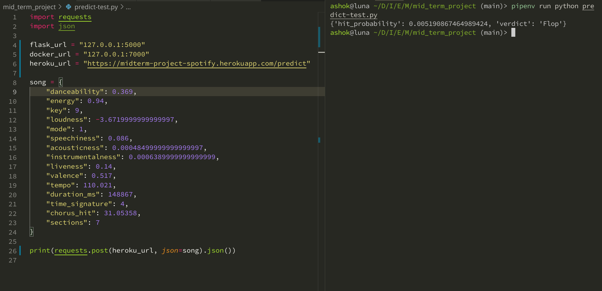

# DataTalks Zoomcamp Midterm Project: Spotify Hit Predictor
## Problem description
The following dataset was used for this project: https://www.kaggle.com/theoverman/the-spotify-hit-predictor-dataset

This is a dataset consisting of features for tracks fetched using Spotify's Web API. The tracks are labeled '1' or '0' ('Hit' or 'Flop') depending on some criteria of the author. It can be used to make a **classification model** that predicts whether a track would be a 'Hit' or not.

It consists of the following features: 
- track: The Name of the track.

- artist: The Name of the Artist.

- uri: The resource identifier for the track.

- danceability: Danceability describes how suitable a track is for dancing based on a combination of musical elements including tempo, rhythm stability, beat strength, and overall regularity. A value of 0.0 is least danceable and 1.0 is most danceable. 

- energy: Energy is a measure from 0.0 to 1.0 and represents a perceptual measure of intensity and activity. Typically, energetic tracks feel fast, loud, and noisy. For example, death metal has high energy, while a Bach prelude scores low on the scale. Perceptual features contributing to this attribute include dynamic range, perceived loudness, timbre, onset rate, and general entropy. 

- key: The estimated overall key of the track. Integers map to pitches using standard Pitch Class notation. E.g. 0 = C, 1 = C?/D?, 2 = D, and so on. If no key was detected, the value is -1.

- loudness: The overall loudness of a track in decibels (dB). Loudness values are averaged across the entire track and are useful for comparing relative loudness of tracks. Loudness is the quality of a sound that is the primary psychological correlate of physical strength (amplitude). Values typical range between -60 and 0 db. 

- mode: Mode indicates the modality (major or minor) of a track, the type of scale from which its melodic content is derived. Major is represented by 1 and minor is 0.

- speechiness: Speechiness detects the presence of spoken words in a track. The more exclusively speech-like the recording (e.g. talk show, audio book, poetry), the closer to 1.0 the attribute value. Values above 0.66 describe tracks that are probably made entirely of spoken words. Values between 0.33 and 0.66 describe tracks that may contain both music and speech, either in sections or layered, including such cases as rap music. Values below 0.33 most likely represent music and other non-speech-like tracks. 

- acousticness: A confidence measure from 0.0 to 1.0 of whether the track is acoustic. 1.0 represents high confidence the track is acoustic. The distribution of values for this feature look like this:

- instrumentalness: Predicts whether a track contains no vocals. “Ooh” and “aah” sounds are treated as instrumental in this context. Rap or spoken word tracks are clearly “vocal”. The closer the instrumentalness value is to 1.0, the greater likelihood the track contains no vocal content. Values above 0.5 are intended to represent instrumental tracks, but confidence is higher as the value approaches 1.0. The distribution of values for this feature look like this:

- liveness: Detects the presence of an audience in the recording. Higher liveness values represent an increased probability that the track was performed live. A value above 0.8 provides strong likelihood that the track is live.

- valence: A measure from 0.0 to 1.0 describing the musical positiveness conveyed by a track. Tracks with high valence sound more positive (e.g. happy, cheerful, euphoric), while tracks with low valence sound more negative (e.g. sad, depressed, angry).

- tempo: The overall estimated tempo of a track in beats per minute (BPM). In musical terminology, tempo is the speed or pace of a given piece and derives directly from the average beat duration. 

- duration_ms:  The duration of the track in milliseconds.

- time_signature: An estimated overall time signature of a track. The time signature (meter) is a notational convention to specify how many beats are in each bar (or measure).

- chorus_hit: This the the author's best estimate of when the chorus would start for the track. Its the timestamp of the start of the third section of the track. This feature was extracted from the data received by the API call for Audio Analysis of that particular track.

- sections: The number of sections the particular track has. This feature was extracted from the data received by the API call for Audio Analysis of that particular track.

- target: The target variable for the track. It can be either '0' or '1'. '1' implies that this song has featured in the weekly list (Issued by Billboards) of Hot-100 tracks in that decade at least once and is therefore a 'hit'. '0' Implies that the track is a 'flop'.

  - The author's condition of a track being 'flop' is as follows:

    - The track must not appear in the 'hit' list of that decade.
    - The track's artist must not appear in the 'hit' list of that decade.
    - The track must belong to a genre that could be considered non-mainstream and / or avant-garde. 
    - The track's genre must not have a song in the 'hit' list.
    - The track must have 'US' as one of its markets.
## EDA
The following experiments were performed in the colab notebook for the analysis:
- Check for missing values
- Check for class imbalances by analysing the target variable
- Range of numerical attributes
- Mean of each numerical attribute for the corresponding class 
(this helps in drawing a line between the two categories)
- Histogram plot of each numerical attribute
- Check for Pearson and Spearman correlation to remove extra features. 
- Finding ANOVA values to see which numerical attributes are useful.

## Model training
Four models were trained on the dataset by splitting it into train/test/val of 60/20/20 %. They are:

- Logistic Regression,
- Decision Tree,
- Random Forest,
- and, XGB Boost

The accuracy before and after tuning for all the four models is as follows: 
| Model               | Accuracy on val (untuned)(in %) | Accuracy on val (tuned)(in %) |
|---------------------|---------------------------------|-------------------------------|
| Logistic Regression | 48.28                           | 80.84                         |
| Decision Tree       | 69.97                           | 81.90                         |
| Random Forest       | 86.94                           | 87.23                         |
| XG Boost            | 86.78                           | 87.30                         |

The best model was found to be XG Boost.
## Exporting notebook to script
The logic for training the best model is exported to a separate script named `train.py`.
## Model deployment
The model is deployed with Flask and is saved in a file named `predict.py`. The file `predict-test.py` can be used to test the Flask application.
## Dependency and enviroment management
The dependencies are managed using `pipenv` so you will need to have it installed on your system. It uses `Pipfile` and `Pipfile.lock` files for dependency management.

The dependencies can be installed by running `pipenv install` inside this directory and it will create a virtual environment inside the folder using those two files.

The file `requirements.txt` contains the list of dependencies in an easy to read format.

## Containerization
The file `Dockerfile` present in the directory can be used to create a Docker image which can then be used to run a container.

First, build the image using:

```docker build -t spotify-hit .```

and now run the image inside a container using:

```docker run -p 7000:7000 spotify-hit```

You can send request to the running container by making use of code in `predict-test.py` or use Postman to send a POST request.

## Cloud deployment

The Flask application is deployed to Heroku. It uses the `Procfile` present in the directory. It specifies the web server to use (gunicorn) and the filename (predict.py).

Steps followed to deploy to Heroku:

- ```git init```
- ```git add .```
- ```git commit -m "Adds files for mid-term project"```
- ```/snap/bin/heroku git:remote -a midterm-project-spotify```
- ```git push heroku main```

`midterm-project-spotify` is the name of the project that I created on the Heroku website.

Here's a screenshot testing the hosted application:


